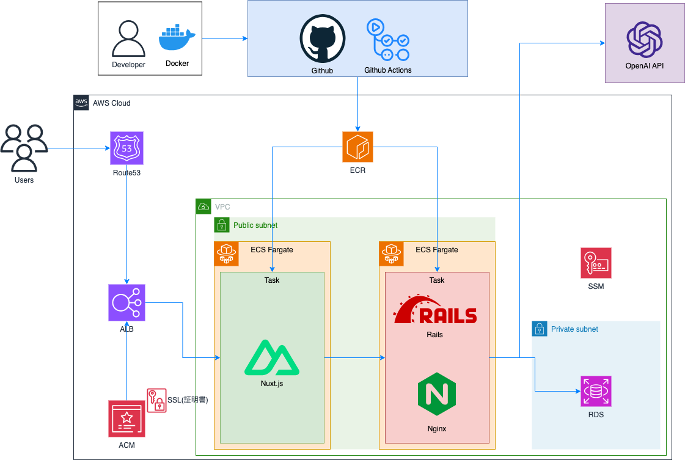
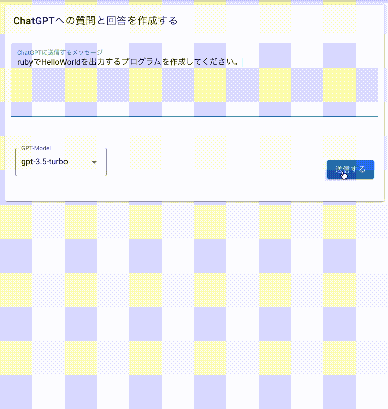

| # | 目次 |
| ---- | ---|
| 1 | [prompthub](#prompthub) |
| 2 | [作成背景](#作成背景) |
| 3 | [使用技術](#使用技術) |
| 4 | [機能一覧](#機能一覧) |
| 5 | [インフラ構成図](#インフラ構成図) |
| 6 | [工夫した点](#工夫した点) |

 

# prompthub

prompthubはChatGPTの使用例(prompt)を共有するサービスです。
ユーザーはこのアプリを通してChatGPTの新たな使い方の発見ができます。

 

# 作成背景

誰にとってもわかりやすいChatGPTのカタログが欲しいと考えたのでこのアプリを作成しました。

私はChatGPTのサービスが好きで、特にプログラミング学習のサポートに活用していました。

プログラミング以外の生活のさまざまな方面でもChatGPTを使いたいと考えたため色々なサイトを回りましたが、包括的にまとめているサイトはあまりなく、他のユーザーに関してもChatGPTを使いこなしている人とそうでない方で差があるように感じました。

そこでChatGPTの使い方を共有できるサービスがあれば自分にとっても他の人にとってもChatGPTの使い方を広げられて有意義だと考えたのでこのサービスを作成しました。

# 使用技術
| バックエンド
----|
| Ruby 2.7.2 |
| Rails  6.1.7.3 |
| MySQL 8.0.31|
| Nginx/puma |
| RuboCop |
| Rspec |
 

| フロントエンド
----|
| Nuxt.js 2.15.8(SPA mode)  |
| Vuetify 1.12.3 |
| axios |
| eslint/prettier(静的解析、フォーマッター) |
| Jest |
 

| インフラ
----|
| docker / docker-compose  |
| GitHub Actions |
| AWS (Route53,ALB,VPC,subnet,ECR,ECS,RDS,ACM,SSM) |
 

# 機能一覧
- JWT
  - 新規作成
  - ログイン機能
  - ログアウト機能
  - サイレントリフレッシュ機能
- ChatGPTサンプル
  - 閲覧
  - 作成 (アドミンユーザのみ)
  - 編集 (アドミンユーザのみ)
  - 削除 (アドミンユーザのみ)
  - いいね機能
  - サンプルの並び替え(人気順・新着順)
  - ワンクリックコピー
- カテゴリの絞り込み
 

# インフラ構成図

 

# 工夫した点
- 読みやすいコードの意識
  - コード整形ツールを導入して各機能を実装する度にコードのフォーマット化を行いました。
    (バックエンド:Rubocop,フロントエンド:eslint,prettier)
  - メンターサービスを利用してコードレビューをしていただき、問題点を教えていただいた上で
    改善し、再度コードレビューをしてもらうサイクルを繰り返し、コードの質の向上に努めました。
- OpenAI APIを使ったデータの取得
  - プロンプトを作成するときにOpenAI APIを使いデータを取得させるようにしました。
  - さらにメッセージ履歴をフロントエンド側に保存させて継続的な会話を可能にしています。

 

